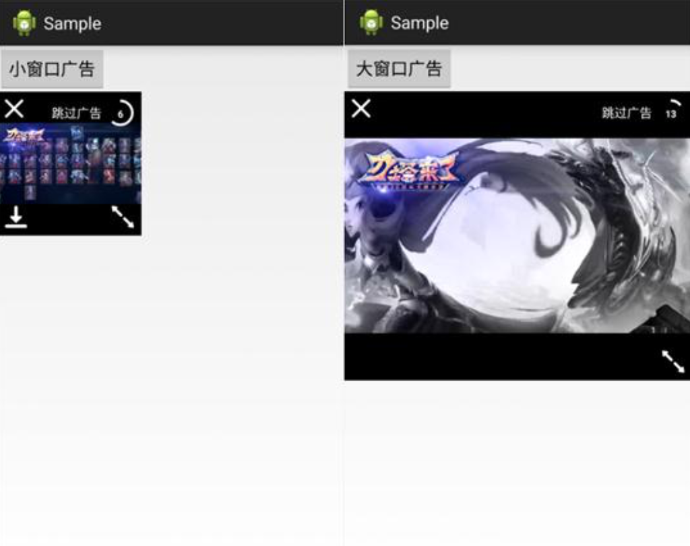

# 视频广告SDK android SDK 2.0.7 开发文档
### 1、导入sdk
	将sdk的jar文件导入到工程指定的libs目录，添加引用支持即可。
### 2、权限配置
	请将下面权限配置代码复制到AndroidManifest.xml文件中：
	<!-- 配置权限 -->
	<uses-permission android:name="android.permission.INTERNET" />
	<uses-permission 
	android:name="android.permission.ACCESS_NETWORK_STATE" />
    <uses-permission android:name="android.permission.ACCESS_WIFI_STATE" />
    <uses-permission android:name="android.permission.CHANGE_CONFIGURATION" />
    <uses-permission android:name="android.permission.WRITE_EXTERNAL_STORAGE"/>
    <uses-permission android:name="android.permission.READ_PHONE_STATE" />
    <uses-permission android:name="android.permission.ACCESS_FINE_LOCATION" />
    <uses-permission android:name="android.permission.ACCESS_COARSE_LOCATION" />
###3、广告组件配置
**注意：Android 7.0以上适配多窗口模式有其他配置要求，可参照[官方文档](https://developer.android.com/guide/topics/ui/multi-window.html?hl=zh-cn)**

	请将以下代码复制到AndroidManifest.xml中：
		<activity
            android:name="com.ads.sdk.video.VideoActivity"
            android:configChanges="keyboard|keyboardHidden|orientation|screenSize|screenLayout|smallestScreenSize"
            tools:ignore="UnusedAttribute"
            android:theme="@android:style/Theme.NoTitleBar" />
                        
###Android 7.0适配（如果不需要支持可直接跳过本段）
> 如果App需要支持Android7.0以上的设备，sdk提供了Android7.0多窗口模式和文件共享等相关特性的支持。

**1.在7.0中下载安装apk文件共享必须使用FileProvider，所以需要在AndroidManifest.xml配置如下代码：**

	<!-- 配置provider用于适配7.0, authorities的{{com.sunteng.sdk.video}}部分替换成当前应用包名，
         authorities = "{{BuildConfig.APPLICATION_ID}}.download.fileProvider" ,
          provider_paths为创建在xml文件夹内的资源文件 -->
        <provider
            android:name="android.support.v4.content.FileProvider"
            android:authorities= "com.sunteng.sdk.video.download.fileProvider"
            android:exported="false"
            android:grantUriPermissions="true">
            <meta-data
                android:name="android.support.FILE_PROVIDER_PATHS"
                android:resource="@xml/provider_paths"/>
        </provider>
        

> 注意：如果你的项目之前已经在AndroidManifest.xml配置过FileProvider，sdk也提供了在代码中统一配置FileProvider的接口设置authorities:

` public static void setFileProviderAuthorities(String authorities);`


**2.可以看到上面在AndroidManifest.xml的<meta-data中，定义了一个资源路径，第二步就是创建res/xml/provider_paths.xml文件：**
> **注意：只需把path中{{com.sunteng.sdk.video}}部分替换成你当前项目的包名，复制到文件中即可。**

	<?xml version="1.0" encoding="utf-8"?>
	<paths xmlns:android="http://schemas.android.com/apk/res/android">
   		<!--把path中{{com.sunteng.sdk.video}}部分替换成项目的包名 path = Android/data/{{应用包名}}/files/SVideo/-->
    	<external-path name="sunteng_video_sdk_download_apk" path="Android/data/com.sunteng.sdk.video/files/SVideo/"/>
</paths>

###4、初始化SDK
> 导入sdk包：import com.sunteng.sdk.api.MobileAdSDK;

- **调用全局初始化sdk：**

		MobileAdSDK.initSDKWithPublishedID(String AdUnitId, String AppSecret)
 > **注意:**
 > 从Sunteng获取AdUnitId & AppSecret
 
- **开启debug模式**
> 用于测试阶段日志输出控制，设置logcat过滤器tag为“videoSdk”。

		/**
	    * 若是在测试时使用需开启
	    * @param isDebug 传入true开启
	    */
	    MobileAdSDK.setDebug(boolean isDebug)
 	

###5、创建视频广告位
> 导入sdk包：import com.sunteng.sdk.api.MobileAdSDK;

	/**
	 * 创建一个全屏模式视频广告组件
	 * @param viewId 视频广告的视图id
	 * @return
	 */
	public static FullModelVideoAd createFullModelVideoAd(int viewId);
	
	/**
	 * 创建一个窗口模式视频广告组件
	 * @param viewId 视频广告的视图id
	 * @return
	 */
	public static WindowModelVideoAd createWindowModelVideoAd(int viewId);
> **注意：要区分全屏模式和窗口模式，对于创建的同一个VideoAd而言，只能支持一种模式下的视频播放！**

**示例代码：**

	VideoAd windowModelVideoAd = MobileAdSDK.createVideoAd(int viewId);
	VideoAd FullModelVideoAd = MobileAdSDK.createVideoAd(int viewId);
###6、广告位请求和内容加载
- **预加载请求广告和下载资源**
> 预加载包括预先请求广告和广告资源下载，提供VideoAdRequestListener回调。

		/**
		 * 提前获取广告数据，默认在Wi-Fi网络情况下载，如果isForced设为true开启强制加载视频
		 * @param activity
		 * @param listener 广告监听器
		 * @param isForced 设为true时在Wi-Fi网络情况下预先下载广告资源 false不区分网络环境，获取网络成功后强制下载广告资源
		 */
		void preDownloadResource(Activity activity, VideoAdRequestListener listener, boolean isForced);

**示例代码**		
```
	windowModelVideoAd.preDownloadResource(DemoActivity.this, videoAdRequestListener, true)
```

- **请求广告，判断是否有广告可用（不会下载广告资源）**

		/**
        * 判断是否有广告视频可以播放，手动触发获取广告数据请求
        * @param activity
        * @param listener
        */
 		void isHaveVideo(Activity activity, VideoAdRequestListener listener);

示例代码
``` 
	windowModelVideoAd.isHaveVideo(DemoActivity.this, videoAdRequestListener)
```

###7、广告请求监听器VideoAdRequestListener

		 VideoAdRequestListener videoAdLoadListener = new VideoAdRequestListener() {
        		@Override
        		public void onRequestSucceed(int viewId) {
           			 Tool.printInfo("onRequestSucceed " + viewId);
           		}

			    @Override
			    public void onRequestFail(int viewId, int errorCode) {
			        Tool.printInfo("onRequestFail " + viewId + errorCode);
			    }

		        @Override
		        public void onAdResourceReady(int viewId) {
		            Tool.printInfo("onAdResourceReady " + viewId);
		        }
			}
|请求返回码  | 数值  |   含义          |
|:-----  |:-----:| :-----------:         |
|MobileAdSDK.BLANK_RESPONSE| 201   |	竞价请求失败，留白  |
|MobileAdSDK.BACK_AMOUNT_RESPONSE  | 202   |  竞价请求失败，返量  |
|MobileAdSDK.ERROR_NO_VIDEO| 204   | 获取广告视频失败错误  |
|MobileAdSDK.ERROR_DOWNLOAD| 400   | 广告资源下载错误     |
			
###8、播放全屏模式视频广告
> **注意：播放全屏模式视频广告是通过启动一个新的 Activity 来展示，只有全屏播放一种效果。所以全屏模式视频广告不提供缩放功能，而窗口模式视频广告支持。**

	/**
     * 在播放FullModel视频，同一个videoAd只适用于一种模式下广告视频的播放
     * @param context
     * @param listener
     */
    void showVideo(Context context, VideoAdListener listener);
    
**示例代码**
```
	fullModelVideoAd. showVideo(this, videoAdListener);
```
 

###9、播放窗口模式视频广告
> **注意：窗口模式视频广告支持窗口大小自定义，只需传入一个用于展示播放界面的布局容器relativeLayout即可，并且窗口模式视频广告支持缩放，所以具有全屏播放和小窗口播放两种展示效果**

	  /**
       * 播放WindowModel视频，同一个videoAd只适用于一种模式下广告视频的播放
       * @param activity 上下文
       * @param relativeLayout 播放组件view容器
       * @param listener 广告监听器，当成功播放视频或者错误播放均会回调
       */
    void showVideo(Activity activity, RelativeLayout relativeLayout, VideoAdListener listener);

**示例代码**
```
	windowModelVideoAd.showVideo(this, relativeLayout, videoAdListener);
```
    
**注意：展现窗口模式视频广告需要主动控制其生命周期，所以需要在Activity的onPause()与onResume()生命周期中调用下面的方法：（全屏模式的广告位不需要）**

     windowModelVideoAd.onPause();
     windowModelVideoAd.onReusme();
         
**窗口模式视频自定义播放窗口大小的效果（支持缩放和全屏播放）**


**窗口模式视频全屏播放效果**


###10、广告监听器VideoAdListener
 > **广告视频播放监听器:**
 	
 	//所有广告资源下载完，播放组件显示完成时回调
 	//可在回调中设置自动播放：windowModelVideoAd.playAlreadyPreparedVideo();
 	VideoAdListener.onReadyPlay(int viewid)
 	
 	//广告显示成功后会回调
 	VideoAdListener.onVideoAdFinished(int viewid, int stateCode)  
 	
 	//广告显示失败后会调用
 	VideoAdListener.onVideoAdError((int viewid,  int errorCode)

|播放状态返回码      | 数值  |   含义          |
|:-----       |:-----:| :-------:         |
|MobileAdSDK.PLAYDONE| 200   |	播放完视频后用户点击了返回  |
|MobileAdSDK.INSTALL_APK_DONE      | 201   |  安装了推广的app后返回  |
|MobileAdSDK.PLAYDONE_SKIPVIDEO| 202  |	用户跳过了视频后返回  |
|MobileAdSDK.LAUNCH_APP| 203   |	播放完视频后点击了返回  |
|MobileAdSDK.OPEN_WEB      | 206   |  安装了推广的app后返回  |
|MobileAdSDK.PLAYDONE_CLOSEDETAIL| 208 | 用户看完视频后在推广详情页面点击关闭视频|
| MobileAdSDK.ERROR_NO_VIDEO | 204   |	没有请求到广告内容  |
| MobileAdSDK.ERROR_DOWNLOAD: | 400 |视频下载错误|
| MobileAdSDK.ERROR_PLAYING_VIDEO      | 401   | 播放中错误   |
| MobileAdSDK.ERROR_CLOSEVIDEO      | 402   |  关闭视频失败  |
| MobileAdSDK.ERROR_AUTO_PLAY  | 403   |  自动播放失败  |
| MobileAdSDK.ERROR_MANUAL_DOWNLOAD: | 404 |手动请求下载广告资源失败|

>viewid :创建窗口视频时调用传入视图ID参数

###11、其他设置
- **开启位置信息**

		//默认开启，动态权限获取
		MobileAdSDK.setLocationEnable(boolean enable)
		 
- **开启debug模式**
> 用于测试阶段日志输出控制，设置logcat过滤器tag为“videoSdk”。

		/**
	    * 若是在测试时使用需开启
	    * @param isDebug 传入true开启
	    */
	    MobileAdSDK.setDebug(boolean isDebug)
	    
###12、打包（重要）
> **注意：** 在AndroidManifest.xml文件中指定了android:targetSdkVersion>=14，如果需要兼容Android 7.0以上平台，请务必参照上面所述的7.0适配指导要求。
>

####混淆要求（重要）：
**由于sdk包中应用了反射，请在打包apk在混淆文件中加入如下配置：**

	-keep class com.ads.** { *; }
	-----------处理反射类---------------
	-keep public class com.ads.sdk.api.VideoAdRequestListener{
    public static *** installApk(...);
	}
	-keep public class com.ads.sdk.api.VideoAdRequestListener$*{
	    public static *** installApk(...);
	}
	-keep public class com.ads.sdk.tool.Tool{
	    public static *** invokeReflectMethod(...);
	}
	-keep public class com.ads.sdk.tool.Tool$*{
	    public static *** invokeReflectMethod(...);
	}
	
	